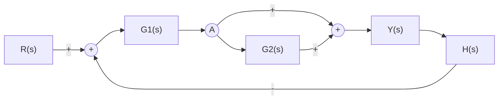
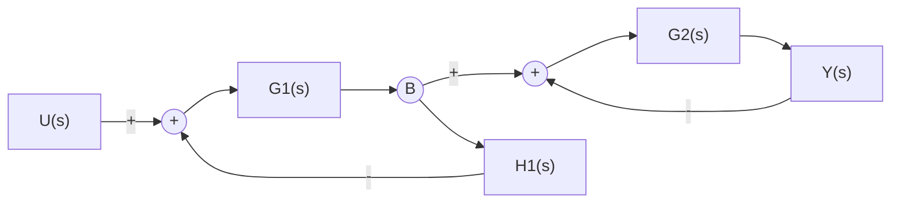
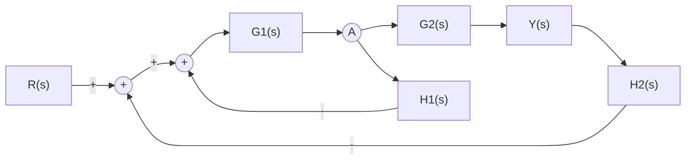
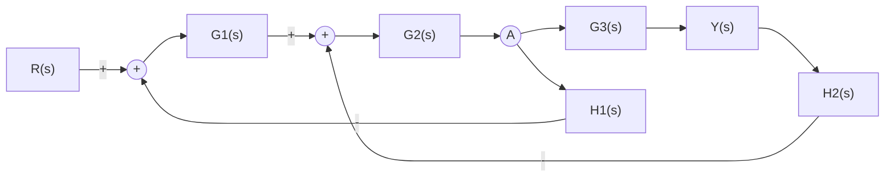

**Exercício 1: Realimentação e Feedforward juntos**

**Exercício 2: Malhas em Cascata Aninhadas**

**Exercício 3: Malhas Concêntricas (Mesmo Nível)**

**Exercício 4: Malhas Sobrepostas (Mais Complexo)**

