# Exercícios – Diagramas de Blocos
### ECAC07 – Modelagem de Sistemas Dinâmicos (UNIFEI)

> Os diagramas abaixo estão em **Mermaid**. Se você colar este arquivo `.md` em um repositório do GitHub (ou abrir no VS Code com a extensão Mermaid), eles serão renderizados automaticamente como imagens.

---

## Exercício 1 — Série e Paralelo (aquecimento)

G₁(s) = 1/(s+1), G₂(s) = 2, G₃(s) = 1/s

**a) Série**


**Resultado (a):**


**b) Paralelo** (todos somados com sinal +)

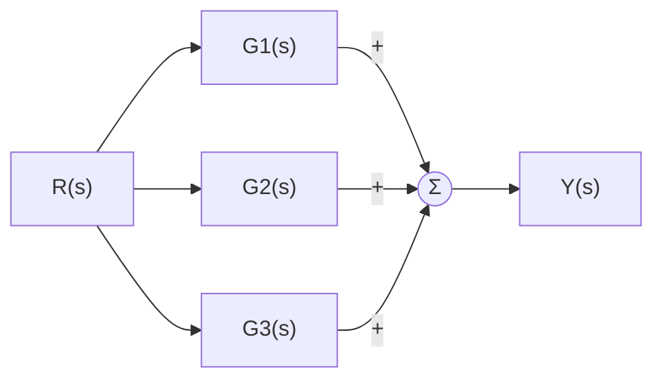

**Resultado (b):**

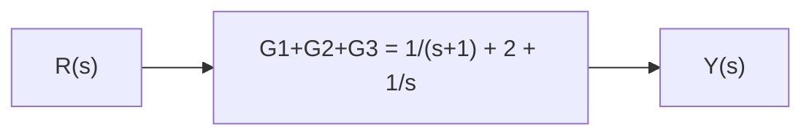

---

## Exercício 2 — Malha de realimentação simples

G(s) = K/(s+2), H(s) = 1

**a) Diagrama (realimentação negativa)**


**b) Resultado (negativa):** Y/R = G/(1+G)


**c) Diagrama e resultado (realimentação positiva)**

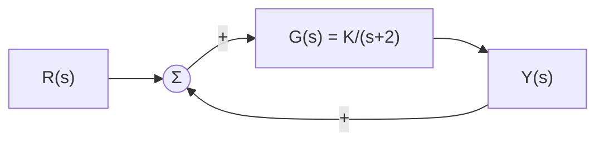

Y/R = G/(1−G):


---

## Exercício 3 — Realimentação com H(s) ≠ 1

G(s) = 10/[s(s+5)], H(s) = (s+1), realimentação negativa

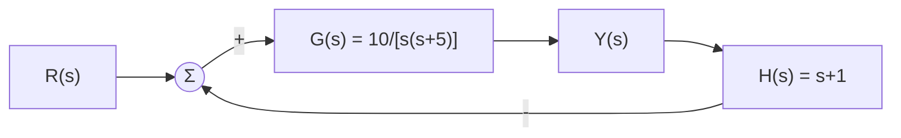

**Resultado:**


---

## Exercício 4 — Diagrama com múltiplos somadores

**a) Diagrama completo**

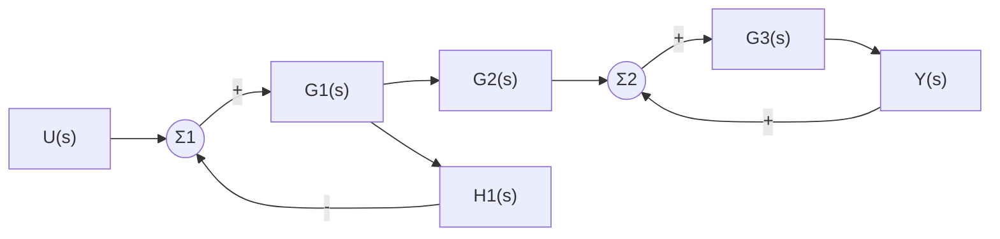

**b) Redução — passo 1:** a malha interna em torno de G1(s) (direta) e H1(s) (realimentação negativa) se fecha, dando

E1(s)/U(s) = G1/(1+G1·H1)   →   saída dessa malha = G1·U/(1+G1H1)

**Redução — passo 2:** essa saída passa por G2(s):

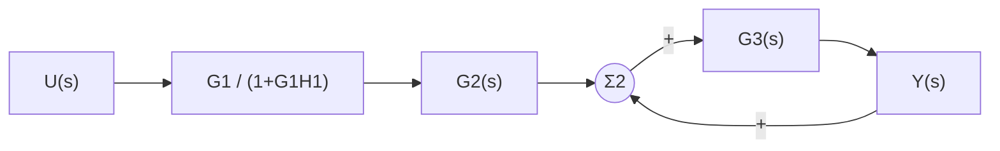

**Redução — passo 3:** a malha em Σ2/G3 é uma realimentação positiva unitária em torno de **apenas G3** (o sinal Y realimenta diretamente a soma que alimenta G3):

Y/B = G3/(1−G3), onde B = G1G2·U/(1+G1H1)

**Resultado final:**

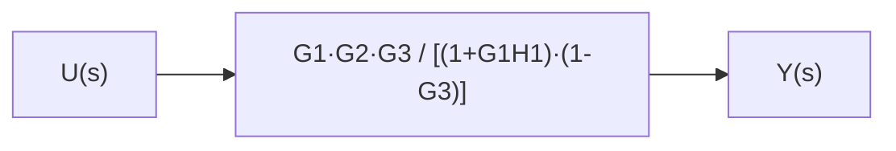

Y(s)/U(s) = **G1(s)G2(s)G3(s) / [(1 + G1(s)H1(s))·(1 − G3(s))]**

---

## Exercício 5 — Sistema de controle com dois laços internos (tipo "ônibus espacial")

**a) Diagrama completo**

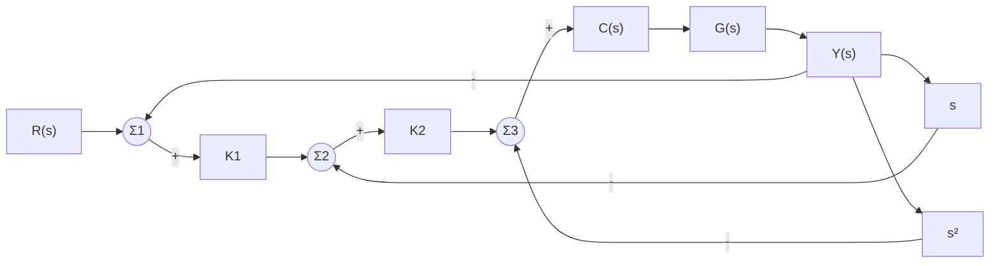

**b) Redução (de dentro para fora):**

1. Malha mais interna (Σ3, com realimentação s² negativa em torno de C·G):
   C(s)G(s) / (1 + C(s)G(s)·s²)

2. Essa malha entra na próxima (Σ2, com K2 e realimentação s negativa):

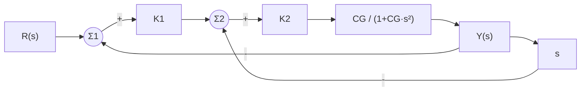

3. Fecha-se essa malha e depois a malha externa com K1 e realimentação unitária negativa.

**Resultado final:**

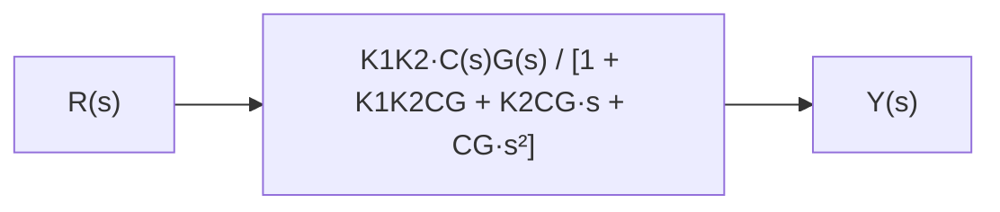

---

## Exercício 6 — Movendo um ponto de ramificação

**Original** (ramificação depois de G(s) — as três saídas já são G(s)·R(s)):

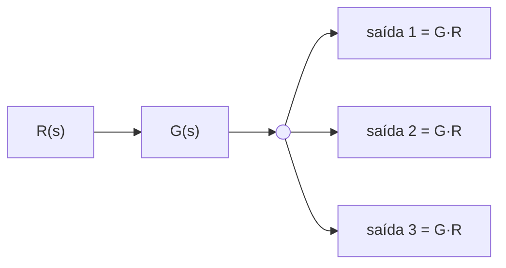

**Equivalente** (ramificação movida para antes de G(s)):

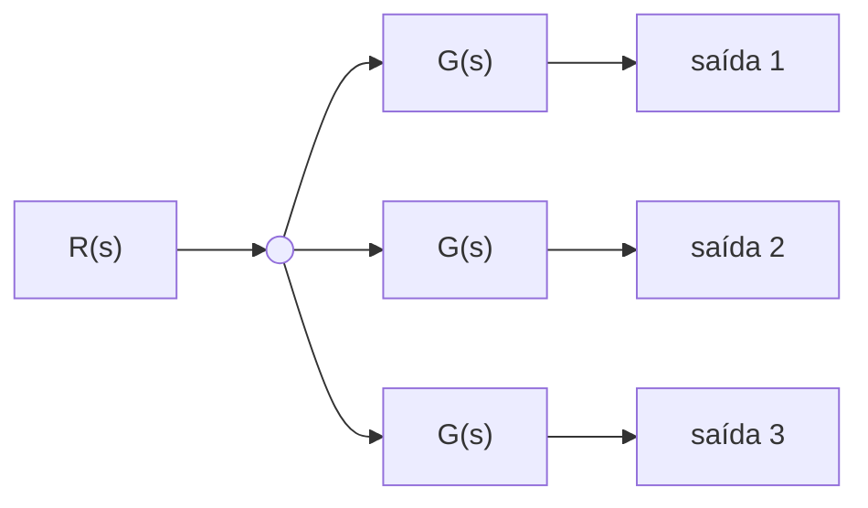

**b) Justificativa:** como a ramificação agora ocorre em R(s) (antes de qualquer processamento), cada um dos três ramos precisa do seu **próprio bloco G(s)** para que a saída de cada ramo continue sendo G(s)R(s), mantendo a equivalência com o diagrama original.

---

## Exercício 7 — Movendo um bloco através de um somador

**Original**

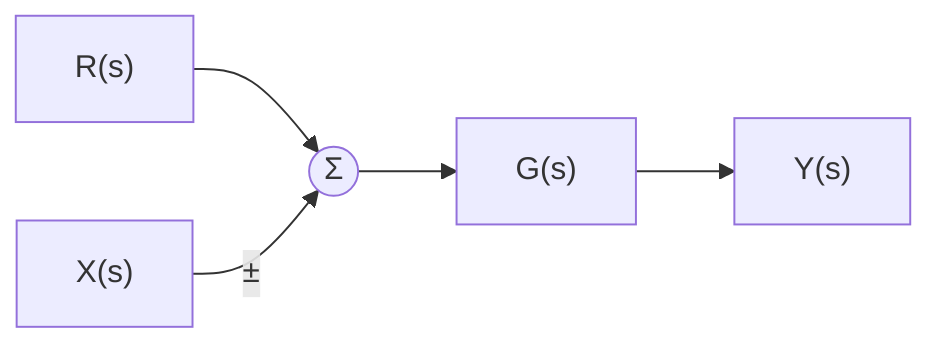

**Equivalente** (G(s) movido para antes do somador)

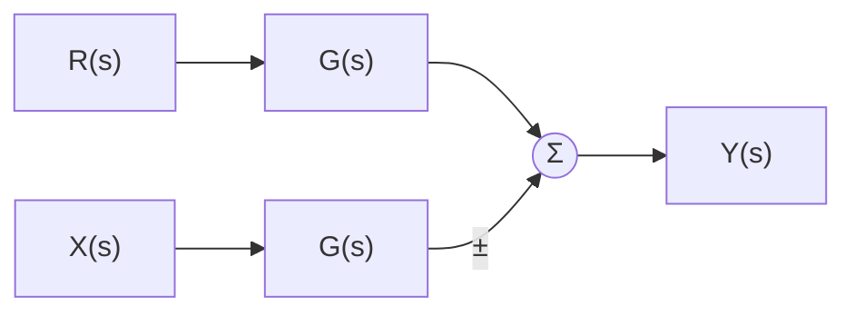

**b) Bloco extra:** um segundo bloco **G(s)** (idêntico, não 1/G(s)) precisa ser inserido no ramo de X(s). Isso porque, no diagrama original, G(s) atuava sobre a soma (R±X); ao mover G(s) para antes do somador, ele precisa continuar atuando sobre **ambos** os sinais para que a saída permaneça G(s)·[R(s) ± X(s)].

---

## Exercício 8 — Diagrama de simulação (domínio do tempo)

**a) ẏ = 10x**

```mermaid
flowchart LR
    x["x(t)"] --> K["10"] --> I(["∫"]) --> y["y(t)"]
```

**b) ẏ + ay = bx**  →  ẏ = bx − ay

```mermaid
flowchart LR
    x["x(t)"] --> Kb["b"] --> S(("Σ"))
    S --> I(["∫"]) --> y["y(t)"]
    y --> Ka["a"] -->|"-"| S
```

**c) ÿ + a1ẏ + a0y = bx**  →  ÿ = bx − a1ẏ − a0y

```mermaid
flowchart LR
    x["x(t)"] --> Kb["b"] --> S(("Σ"))
    S --> I1(["∫"]) --> ydot["ẏ(t)"] --> I2(["∫"]) --> y["y(t)"]
    ydot --> Ka1["a1"] -->|"-"| S
    y --> Ka0["a0"] -->|"-"| S
```

**d) ẏ + ay = ẋ + bx** (tem derivada de x — "cuidado")

*Truque:* defina v(t) = y(t) − x(t). Então v̇ = ẏ − ẋ = (bx − ay) = (b−a)x − a(v+x), ou seja:

v̇ + av = (b−a)x   (sem derivada de x!), e depois y = v + x.

```mermaid
flowchart LR
    x["x(t)"] --> Kba["(b-a)"] --> S(("Σ"))
    S --> I(["∫"]) --> v["v(t)"]
    v --> Ka["a"] -->|"-"| S
    v -->|"+"| Sy(("Σ"))
    x -->|"+"| Sy
    Sy --> y["y(t)"]
```

---

## Exercício 9 — Desafio (síntese Aula 1 + Aula 2)

Sistema massa-mola-amortecedor: m·ẍ + b·ẋ + k·x = F(t)

**a) Espaço de estados:** x1 = x, x2 = ẋ

ẋ1 = x2
ẋ2 = (1/m)·(F − b·x2 − k·x1)

*(relação com Aula 1: assim como no pêndulo, conhecer apenas x1=x não basta — é preciso também x2=ẋ para determinar univocamente o comportamento futuro, pois a força resultante depende da velocidade via o termo de amortecimento b·ẋ)*

**b) Função de transferência:**

X(s)/F(s) = 1 / (ms² + bs + k)

**c) Diagrama de blocos (Laplace):**

```mermaid
flowchart LR
    F["F(s)"] --> Geq["1 / (m s² + b s + k)"] --> X["X(s)"]
```

**d) Diagrama de simulação (domínio do tempo, 2 integradores):**

```mermaid
flowchart LR
    F["F(t)"] --> S(("Σ"))
    S --> Km["1/m"] --> I1(["∫"]) --> xdot["ẋ(t)"] --> I2(["∫"]) --> x["x(t)"]
    xdot --> Kb["b"] -->|"-"| S
    x --> Kk["k"] -->|"-"| S
```

---

## Gabarito rápido (resumo das respostas)

1a) 2/[s(s+1)]  |  1b) 1/(s+1) + 2 + 1/s
2b) K/(s+2+K)  |  2c) K/(s+2−K)
3) 10/(s² + 15s + 10)
4) G1G2G3 / [(1+G1H1)(1−G3)]
5) K1K2·C·G / [1 + K1K2CG + K2CG·s + CG·s²]
9b) 1/(ms² + bs + k)

Qualquer dúvida na leitura de algum diagrama ou na redução algébrica, me chame que resolvemos juntos passo a passo.
