# Exercícios – Diagramas de Blocos
### ECAC07 – Modelagem de Sistemas Dinâmicos (UNIFEI)

> Os diagramas abaixo estão em **Mermaid**. Se você colar este arquivo `.md` em um repositório do GitHub (ou abrir no VS Code com a extensão Mermaid), eles serão renderizados automaticamente como imagens.

---

## Exercício 1 — Série e Paralelo (aquecimento)

Considere um sistema com entrada R(s) e saída Y(s) formado por três blocos:
G₁(s) = 1/(s+1), G₂(s) = 2, G₃(s) = 1/s

### a) Configuração em série

**Diagrama do problema:**


**Passo a passo:** em uma configuração série, a saída de cada bloco é a entrada do próximo. Logo, o sinal total sofre a ação de G1, depois G2, depois G3, em cascata. A função de transferência equivalente é simplesmente o **produto** das três:

G_eq(s) = G1(s)·G2(s)·G3(s) = [1/(s+1)]·2·[1/s] = **2 / [s(s+1)]**

**Diagrama do resultado:**

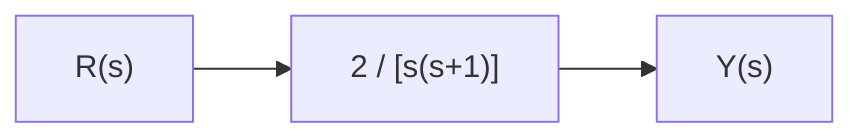

### b) Configuração em paralelo (todos somados com sinal +)

**Diagrama do problema:**

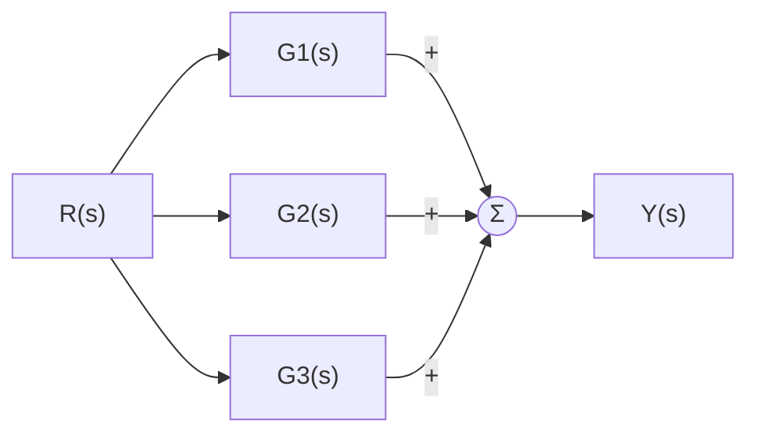

**Passo a passo:** em paralelo, o mesmo sinal R(s) alimenta os três blocos simultaneamente, e as saídas são somadas. A função de transferência equivalente é a **soma algébrica**:

G_eq(s) = G1(s) + G2(s) + G3(s) = **1/(s+1) + 2 + 1/s**

**Diagrama do resultado:**


---

## Exercício 2 — Malha de realimentação simples

Um sistema tem um bloco direto G(s) = K/(s+2) e realimentação unitária (H(s) = 1).

### a) e b) Realimentação negativa

**Diagrama do problema:**


**Passo a passo:**
1. O sinal de erro na junção soma é: E(s) = R(s) − Y(s)
2. A saída é: Y(s) = G(s)·E(s) = G(s)·[R(s) − Y(s)]
3. Distribuindo: Y(s) = G(s)R(s) − G(s)Y(s)
4. Isolando Y(s): Y(s) + G(s)Y(s) = G(s)R(s) → Y(s)[1+G(s)] = G(s)R(s)
5. Logo: **Y(s)/R(s) = G(s) / [1+G(s)]**

Substituindo G(s) = K/(s+2):

Y(s)/R(s) = **K / (s+2+K)**

**Diagrama do resultado:**


### c) Realimentação positiva

**Diagrama do problema:**

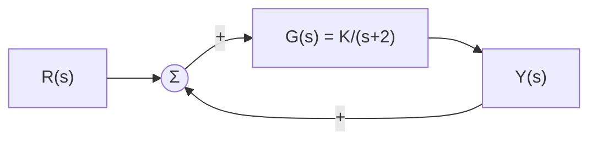

**Passo a passo:** o mesmo raciocínio do item (b), mas agora E(s) = R(s) + Y(s), o que muda o sinal do termo de realimentação no denominador:

**Y(s)/R(s) = G(s) / [1−G(s)] = K / (s+2−K)**

**Diagrama do resultado:**

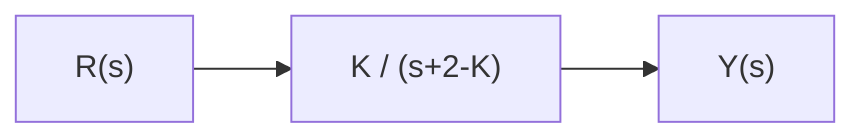

---

## Exercício 3 — Realimentação com H(s) ≠ 1

Sistema com bloco direto G(s) = 10/[s(s+5)] e realimentação negativa H(s) = (s+1).

**Diagrama do problema:**

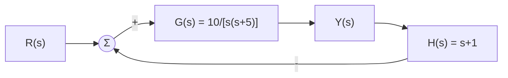

**Passo a passo:**
1. Erro: E(s) = R(s) − H(s)·Y(s)
2. Saída: Y(s) = G(s)·E(s) = G(s)·R(s) − G(s)H(s)·Y(s)
3. Isolando: Y(s)·[1 + G(s)H(s)] = G(s)·R(s)
4. Fórmula geral: **Y(s)/R(s) = G(s) / [1 + G(s)H(s)]**
5. Substituindo os valores:

G(s)H(s) = [10/(s(s+5))]·(s+1) = 10(s+1)/[s(s+5)]

1 + G(s)H(s) = [s(s+5) + 10(s+1)] / [s(s+5)] = (s² + 5s + 10s + 10)/[s(s+5)] = (s² + 15s + 10)/[s(s+5)]

Y(s)/R(s) = G(s) / [1+G(s)H(s)] = {10/[s(s+5)]} · {[s(s+5)]/(s²+15s+10)} = **10 / (s² + 15s + 10)**

**Diagrama do resultado:**


---

## Exercício 4 — Diagrama com múltiplos somadores

Estrutura:
- Entrada U(s) entra em um somador **Σ1** (sinal +).
- Saída de Σ1 passa por **G1(s)** e depois por **G2(s)**, chegando ao somador **Σ2** (sinal +).
- Saída de Σ2 passa por **G3(s)**, produzindo **Y(s)**.
- Realimentação 1: a saída de G1(s) (antes de G2) volta por **H1(s)** até Σ1, com sinal **−**.
- Realimentação 2: a saída Y(s) volta diretamente (ganho unitário) até Σ2, com sinal **+**.

**Diagrama do problema:**

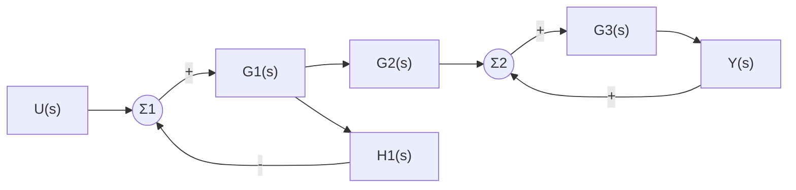

**Passo a passo:**

**1. Identifique a malha mais "interna" que pode ser fechada primeiro.** A malha em torno de G1(s), com realimentação negativa H1(s) saindo do próprio G1, é uma malha de realimentação clássica:

E1(s) = U(s) − H1(s)·A(s), onde A(s) = G1(s)·E1(s)

Isolando: A(s)/U(s) = G1(s) / [1 + G1(s)H1(s)]

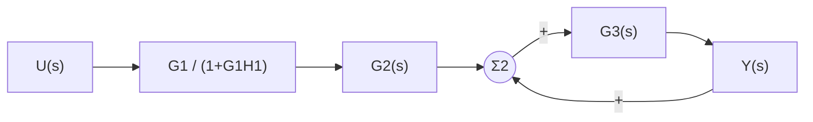

**2. Multiplique pelo bloco em série G2(s):**

B(s)/U(s) = G1(s)G2(s) / [1 + G1(s)H1(s)]

**3. Agora resolva a malha em Σ2 — repare que ali a realimentação de Y(s) é **em torno de G3(s) apenas** (positiva, unitária):

Y(s) = G3(s)·[B(s) + Y(s)] → Y(s)·[1 − G3(s)] = G3(s)·B(s)

Y(s)/B(s) = G3(s) / [1 − G3(s)]

**4. Combine os dois resultados (passo 2 × passo 3):**

**Y(s)/U(s) = G1(s)·G2(s)·G3(s) / { [1 + G1(s)H1(s)]·[1 − G3(s)] }**

**Diagrama do resultado:**

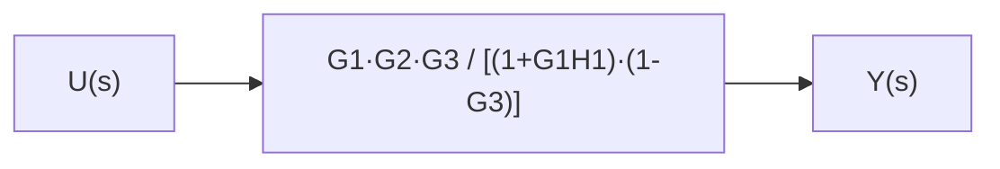

---

## Exercício 5 — Sistema de controle com dois laços internos (tipo "ônibus espacial")

Estrutura (compare com a Aula 2, slide 5):
- Erro E(s) = R(s) − Y(s) (realimentação principal, unitária) passa por ganho **K1**.
- Resultado entra em Σ2, subtraindo uma realimentação de **taxa** (bloco **s** aplicado a Y), e passa por ganho **K2**.
- Resultado entra em Σ3, subtraindo uma realimentação de **aceleração** (bloco **s²** aplicado a Y), passa pelo controlador **C(s)** e pela planta **G(s)**, gerando Y(s).

**Diagrama do problema:**

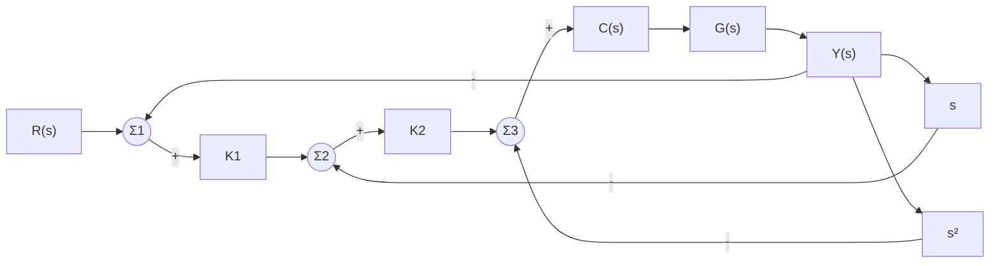

**Passo a passo (resolva sempre de dentro para fora, malha mais interna primeiro):**

**1. Malha mais interna (Σ3):** realimentação negativa de s²·Y em torno de C(s)G(s):

Chamando e3 = saída de Σ3, e Y = C·G·e3, e e3 = b − s²Y (onde b é a saída de Σ2):

Y = CG·(b − s²Y) → Y(1+CG·s²) = CG·b → **Y/b = CG / (1+CG·s²)**

**2. Malha do meio (Σ2):** agora essa malha CG/(1+CGs²) está em série com K2, e há realimentação negativa de s·Y em torno desse conjunto. Chamando a = saída de Σ1:

b = K2·(a − sY)

Substituindo na equação do passo 1:

Y = [CG/(1+CGs²)]·K2·(a − sY)

Y·[1 + CG·s²)] = K2·CG·a − K2·CG·s·Y ... reorganizando:

Y·[1 + CG·s² + K2·CG·s] = K2·CG·a → **Y/a = K2CG / (1+CGs²+K2CGs)**

**3. Malha externa (Σ1):** a = K1·(R−Y). Substituindo:

Y = [K2CG/(1+CGs²+K2CGs)]·K1·(R−Y)

Y·[1+CGs²+K2CGs] = K1K2CG·R − K1K2CG·Y

Y·[1+CGs²+K2CGs+K1K2CG] = K1K2CG·R

**Resultado final:**

**Y(s)/R(s) = K1K2·C(s)G(s) / [1 + K1K2·C(s)G(s) + K2·C(s)G(s)·s + C(s)G(s)·s²]**

**Diagrama do resultado:**

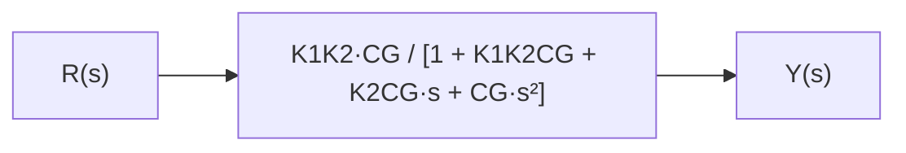

---

## Exercício 6 — Movendo um ponto de ramificação

Diagrama: R(s) passa por G(s); depois de G(s), há um ponto de ramificação que gera três saídas idênticas (todas iguais a G(s)R(s)).

**Diagrama do problema (ramificação depois de G(s)):**

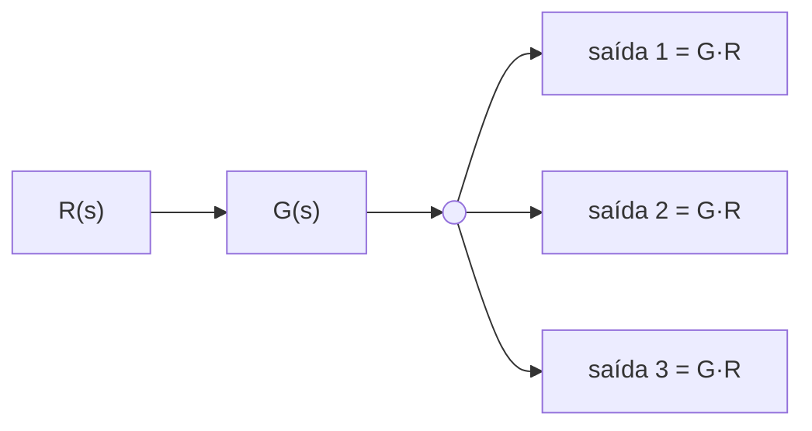

**a) Diagrama equivalente (ramificação movida para antes de G(s)):**

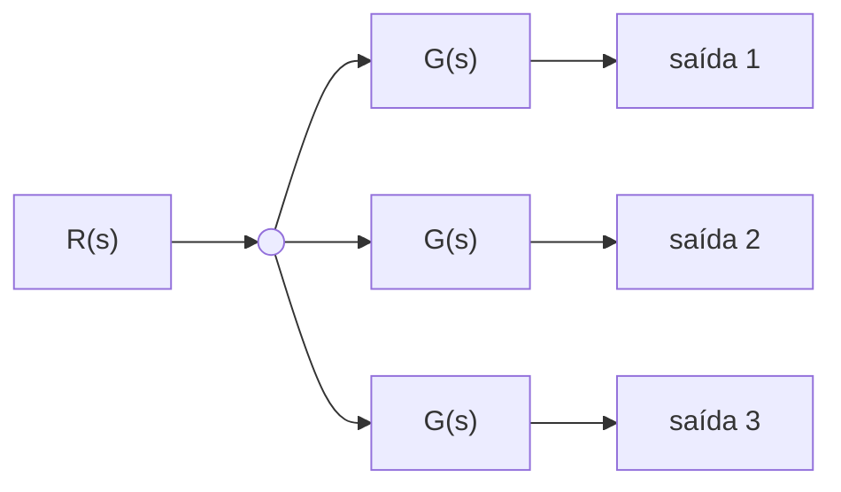

**b) Justificativa:** no diagrama original, todas as três saídas valem G(s)·R(s), pois a ramificação ocorre **depois** do processamento por G(s). Se movermos o ponto de ramificação para **antes** de G(s), cada ramo passa a começar a partir de R(s) "puro" — logo, para que cada saída continue valendo G(s)·R(s), é necessário inserir uma **cópia do bloco G(s)** em cada um dos três ramos. Essa é a regra vista na Aula 2 (slide 13): mover um ponto de ramificação para trás de um bloco exige replicar esse bloco em todos os ramos afetados.

---

## Exercício 7 — Movendo um bloco através de um somador

Diagrama: R(s) entra em um somador junto com X(s) (sinal ±); o resultado passa por G(s), gerando Y(s).

**Diagrama do problema:**

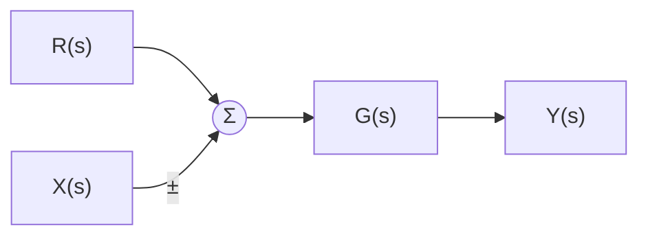

**a) Diagrama equivalente (G(s) movido para antes do somador):**

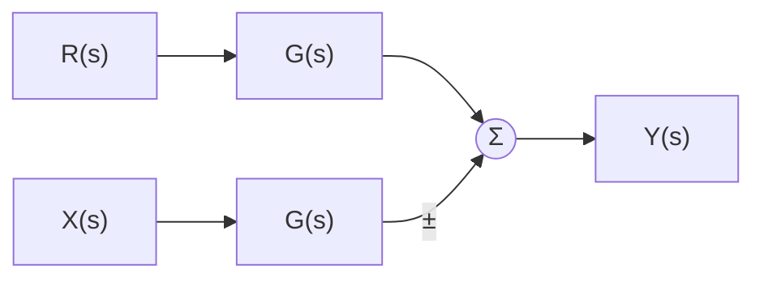

**b) Justificativa (com a álgebra por trás):**

No diagrama original: Y(s) = G(s)·[R(s) ± X(s)] = G(s)R(s) ± G(s)X(s)

Para que o diagrama equivalente produza o mesmo resultado com G(s) atuando **antes** da soma (isto é, aplicado separadamente a cada sinal e depois somado), é necessário que **ambos** os ramos — o de R(s) e o de X(s) — passem por um bloco **G(s)** (o mesmo bloco, não seu inverso). Assim, a soma dos dois ramos processados, G(s)R(s) ± G(s)X(s), reproduz exatamente a saída original.

*Observação:* isso é diferente do caso em que G(s) já está em apenas um dos ramos antes do somador (por exemplo, só no ramo de R) e se quer movê-lo para **depois** da soma. Nesse outro caso, sim, seria necessário inserir 1/G(s) no ramo de X(s), para "compensar" o fato de que G(s) passaria a atuar também sobre X(s) ao ser movido para depois do somador.

---

## Exercício 8 — Diagrama de simulação (domínio do tempo)

Aqui usamos **integradores** (não funções de transferência) para representar as equações diferenciais diretamente no domínio do tempo. A ideia geral é: isole a derivada de maior ordem de y, e vá "integrando" sucessivamente, realimentando os termos de ordem menor.

### a) ẏ = 10x

**Passo a passo:** já está na forma "derivada = função da entrada". Basta um ganho 10 seguido de um integrador.

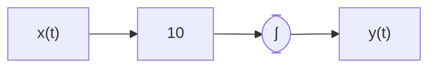

### b) ẏ + ay = bx

**Passo a passo:** isole a derivada: ẏ = bx − ay. Isso significa: um somador recebe b·x (com sinal +) e a·y realimentado (com sinal −); a saída do somador é integrada para gerar y.

```mermaid
flowchart LR
    x["x(t)"] --> Kb["b"] --> S(("Σ"))
    S --> I(["∫"]) --> y["y(t)"]
    y --> Ka["a"] -->|"-"| S
```

### c) ÿ + a1ẏ + a0y = bx

**Passo a passo:** isole a derivada de maior ordem: ÿ = bx − a1ẏ − a0y. Agora precisamos de **dois integradores em cascata**: o primeiro converte ÿ em ẏ, o segundo converte ẏ em y. Os termos ẏ e y são realimentados (com ganhos a1 e a0, sinal negativo) até o somador de entrada.

```mermaid
flowchart LR
    x["x(t)"] --> Kb["b"] --> S(("Σ"))
    S --> I1(["∫"]) --> ydot["ẏ(t)"] --> I2(["∫"]) --> y["y(t)"]
    ydot --> Ka1["a1"] -->|"-"| S
    y --> Ka0["a0"] -->|"-"| S
```

### d) ẏ + ay = ẋ + bx (cuidado: há derivada de x!)

**Passo a passo (truque para eliminar a derivada da entrada):**

1. Não dá para simplesmente integrar ẋ diretamente em um diagrama de simulação "puro" (isso exigiria um bloco derivador, que amplifica ruído e não é fisicamente realizável de forma simples).
2. Defina uma nova variável: **v(t) = y(t) − x(t)**.
3. Derive: v̇ = ẏ − ẋ.
4. Da equação original: ẏ = ẋ + bx − ay. Substituindo em v̇: v̇ = (ẋ + bx − ay) − ẋ = bx − ay.
5. Como y = v + x, substitua: v̇ = bx − a(v+x) = (b−a)x − av.
6. Agora temos uma equação de primeira ordem **sem derivada de x**: **v̇ + av = (b−a)x**.
7. Depois de obter v(t) por um integrador, basta somar x(t) de volta para obter y(t) = v(t) + x(t).

```mermaid
flowchart LR
    x["x(t)"] --> Kba["(b-a)"] --> S(("Σ"))
    S --> I(["∫"]) --> v["v(t)"]
    v --> Ka["a"] -->|"-"| S
    v -->|"+"| Sy(("Σ"))
    x -->|"+"| Sy
    Sy --> y["y(t)"]
```

---

## Exercício 9 — Desafio (síntese Aula 1 + Aula 2)

Sistema massa-mola-amortecedor: **m·ẍ + b·ẋ + k·x = F(t)**, onde F(t) é a entrada (força) e x(t) é a saída (deslocamento).

### a) Espaço de estados

Defina x1 = x (posição) e x2 = ẋ (velocidade). Então:

ẋ1 = x2

ẋ2 = ẍ = (1/m)·(F − b·x2 − k·x1)

**Relação com a Aula 1:** exatamente como no exemplo do pêndulo (θ e θ̇), conhecer apenas a posição x1=x **não é suficiente** para prever o comportamento futuro do sistema — é preciso também saber a velocidade x2=ẋ. Isso porque a força resultante sobre a massa depende da velocidade (através do termo de amortecimento b·ẋ): duas massas na mesma posição, mas com velocidades diferentes, terão trajetórias futuras diferentes. Por isso o **estado** desse sistema é o par (x1, x2) = (x, ẋ).

### b) Função de transferência

Aplicando Laplace com condições iniciais nulas: m·s²X(s) + b·s·X(s) + k·X(s) = F(s)

X(s)·(ms² + bs + k) = F(s)

**X(s)/F(s) = 1 / (ms² + bs + k)**

### c) Diagrama de blocos (domínio de Laplace)

```mermaid
flowchart LR
    F["F(s)"] --> Geq["1 / (m s² + b s + k)"] --> X["X(s)"]
```

### d) Diagrama de simulação (domínio do tempo, 2 integradores)

**Passo a passo:** isole a derivada de maior ordem: ẍ = (1/m)·(F − b·ẋ − k·x). Um somador recebe F (com sinal +) e as realimentações b·ẋ e k·x (ambas com sinal −); o resultado é multiplicado por 1/m e passa por dois integradores em cascata (o primeiro gera ẋ, o segundo gera x).

```mermaid
flowchart LR
    F["F(t)"] --> S(("Σ"))
    S --> Km["1/m"] --> I1(["∫"]) --> xdot["ẋ(t)"] --> I2(["∫"]) --> x["x(t)"]
    xdot --> Kb["b"] -->|"-"| S
    x --> Kk["k"] -->|"-"| S
```

---

## Gabarito rápido (resumo das respostas finais)

| Exercício | Resultado |
|---|---|
| 1a | 2 / [s(s+1)] |
| 1b | 1/(s+1) + 2 + 1/s |
| 2b | K / (s+2+K) |
| 2c | K / (s+2−K) |
| 3 | 10 / (s² + 15s + 10) |
| 4 | G1G2G3 / [(1+G1H1)(1−G3)] |
| 5 | K1K2·CG / [1 + K1K2CG + K2CG·s + CG·s²] |
| 9b | 1 / (ms² + bs + k) |

Qualquer dúvida na leitura de algum diagrama ou em algum passo da álgebra, me chame que resolvemos juntos.
